# Testing Railway-Oriented User Registration System

## Context

```mermaid
flowchart TD
    %% Improved style definitions with more distinct colors and shapes
    classDef input fill:#e0f7fa,stroke:#00838f,stroke-width:2px
    classDef result fill:#e0f7fa,stroke:#00838f,stroke-width:2px
    classDef success fill:#e8f5e9,stroke:#2e7d32,stroke-width:2px,fontColor:#2e7d32
    classDef failure fill:#ffebee,stroke:#c62828,stroke-width:2px,fontColor:#c62828
    classDef process fill:#e3f2fd,stroke:#1565c0,stroke-width:2px
    classDef conditional fill:#fff8e1,stroke:#ff8f00,stroke-width:2px,fontColor:#ff8f00
    classDef endpoint fill:#f3e5f5,stroke:#6a1b9a,stroke-width:2px,fontColor:#6a1b9a
    classDef dberror fill:#ffcdd2,stroke:#c62828,stroke-width:2px,fontColor:#c62828
    classDef dboperation fill:#e1f5fe,stroke:#0277bd,stroke-width:2px

    %% Starting point
    Start(["Registration Request"]):::input --> RegistrationType{"Determine<br>Registration Type"}:::conditional

    %% SELF REGISTRATION RAILWAY
    subgraph SelfRailway["Self Registration Railway"]
        direction LR

        %% Success Track with Result nodes
        RegistrationType -->|Self| RecaptchaValidation["Validate<br>reCAPTCHA"]:::process
        RecaptchaValidation --> RecaptchaValidationResult["Recaptcha Validation Result"]:::result
        RecaptchaValidation -.->|Failure| RecaptchaError["Recaptcha Error"]:::failure
        RecaptchaError -.-> RecaptchaValidationResult
        
        RecaptchaValidationResult -->|Pass to next| FormValidation["Validate<br>User Form"]:::process
        FormValidation --> FormValidationResult["Form Validation Result"]:::result
        FormValidation -.->|Failure: Invalid Data| ValidationCategories
        
        subgraph ValidationCategories["Validation Failure Types"]
            direction TB
            EmailValidationError["Email Error:<br>invalid-format<br>not-work-email"]:::failure
            NameValidationError["Name Error:<br>empty"]:::failure
            PasswordValidationError["Password Error:<br>empty<br>weak"]:::failure

            EmailValidationError & NameValidationError & PasswordValidationError --> ValidationFailure(["Failure:<br>Form Validation Error"]):::failure
        end
        ValidationFailure -.-> FormValidationResult
        
        FormValidationResult -->|Pass to next| UserLookup["DB: Find<br>Existing User"]:::dboperation
        UserLookup --> UserLookupResult["User Lookup Result"]:::result
        UserLookup -.->|Failure: DB Error| UserLookupDBError["DB Error"]:::dberror
        UserLookupDBError -.-> UserLookupResult
        
        UserLookupResult -->|Pass to next| UserExistsCheck{"User<br>Exists?"}:::conditional
        UserExistsCheck -.->|Option is Some| UserExistsError(["Failure:<br>User Already Exists"]):::failure
        UserExistsError -.-> UserExistsResult["User Exists Result"]:::result
        UserExistsCheck -->|Option is None| UserExistsResult
        
        UserExistsResult -->|Pass to next| TeamSlugLookup["DB: Find<br>Team by Slug"]:::dboperation
        TeamSlugLookup --> TeamSlugLookupResult["Team Slug Lookup Result"]:::result
        TeamSlugLookup -.->|Failure: DB Error| TeamSlugLookupDBError["DB Error"]:::dberror
        TeamSlugLookupDBError -.-> TeamSlugLookupResult
        
        TeamSlugLookupResult -->|Pass to next| TeamUniqueCheck{"Team<br>Exists?"}:::conditional
        TeamUniqueCheck -.->|Option is Some| TeamExistsError(["Failure:<br>Team Name Already Taken"]):::failure
        TeamExistsError -.-> TeamUniqueResult["Team Unique Result"]:::result
        TeamUniqueCheck -->|Option is None| TeamUniqueResult
        
        TeamUniqueResult -->|Pass to next| UserCreation["DB: Create<br>User Account"]:::dboperation
        UserCreation --> UserCreationResult["User Creation Result"]:::result
        UserCreation -.->|Failure: DB Error| UserCreationDBError["DB Error"]:::dberror
        UserCreationDBError -.-> UserCreationResult
        
        UserCreationResult -->|Pass to next| TeamCreation["DB: Create<br>Team"]:::dboperation
        TeamCreation --> TeamCreationResult["Team Creation Result"]:::result
        TeamCreation -.->|Failure: DB Error| TeamCreationDBError["DB Error"]:::dberror
        TeamCreationDBError -.-> TeamCreationResult
        
        TeamCreationResult -->|Pass to next| EmailVerification["Send Email<br>Verification"]:::process
        EmailVerification --> EmailVerificationResult["Email Verification Result"]:::result
        EmailVerification -.->|Failure: Email Error| EmailSendError(["Failure:<br>Email Verification Error"]):::failure
        EmailSendError -.-> EmailVerificationResult
        
        EmailVerificationResult -->|Pass to next| MetricsRecord["Record<br>Signup Metrics"]:::process
        MetricsRecord --> MetricsRecordResult["Metrics Record Result"]:::result
        MetricsRecord -.->|Failure: Metric Error| MetricsError(["Failure:<br>Metrics Recording Error"]):::failure
        MetricsError -.-> MetricsRecordResult
        
        MetricsRecordResult -->|Pass to next| SlackNotify["Notify<br>Slack Channel"]:::process
        SlackNotify --> SlackNotifyResult["Slack Notify Result"]:::result
        SlackNotify -.->|Failure: Notify Error| NotificationError(["Failure:<br>Slack Notification Error"]):::failure
        NotificationError -.-> SlackNotifyResult
        
        SlackNotifyResult -->|Pass to next| SuccessResponse["HTTP 201<br>Success Response"]:::endpoint
        
        %% Route all errors to error response
        RecaptchaValidationResult & FormValidationResult & UserLookupResult & TeamSlugLookupResult & UserExistsResult & TeamUniqueResult & UserCreationResult & TeamCreationResult & EmailVerificationResult & MetricsRecordResult & SlackNotifyResult -.->|Failure| ErrorResponse["HTTP Error<br>Response"]:::endpoint
    end

    %% INVITATION RAILWAY
    subgraph InviteRailway["Invitation Registration Railway"]
        direction LR

        %% Success Track with Result nodes
        RegistrationType -->|Invitation| InviteRecaptchaValidation["Validate<br>reCAPTCHA"]:::process
        InviteRecaptchaValidation --> InviteRecaptchaValidationResult["Recaptcha Validation Result"]:::result
        InviteRecaptchaValidation -.->|Failure: Invalid Token| InviteRecaptchaError(["Failure:<br>Invalid reCAPTCHA"]):::failure
        InviteRecaptchaError -.-> InviteRecaptchaValidationResult
        
        InviteRecaptchaValidationResult -->|Success| InvitationLookup["DB: Find<br>Invitation"]:::dboperation
        InvitationLookup --> InvitationLookupResult["Invitation Lookup Result"]:::result
        InvitationLookup -.->|Failure: DB Error| InvitationLookupDBError["DB Error"]:::dberror
        InvitationLookupDBError -.-> InvitationLookupResult
        
        InvitationLookupResult -->|Success| InvitationExistsCheck{"Invitation<br>Exists?"}:::conditional
        InvitationExistsCheck -.->|Option is None| InvitationNotFoundError(["Failure:<br>Invitation Not Found"]):::failure
        InvitationNotFoundError -.-> InvitationExistsResult["Invitation Exists Result"]:::result
        InvitationExistsCheck -->|Option is Some| InvitationExistsResult
        
        InvitationExistsResult -->|Pass to next| InvitationExpiryCheck{"Invitation<br>Expired?"}:::conditional
        InvitationExpiryCheck -.->|Expired| InvitationExpiredError(["Failure:<br>Invitation Expired"]):::failure
        InvitationExpiredError -.-> InvitationExpiryResult["Invitation Expiry Result"]:::result
        InvitationExpiryCheck -->|Not Expired| InvitationExpiryResult
        
        InvitationExpiryResult -->|Pass to next| InviteEmailValidation["Validate<br>Email Format"]:::process
        InviteEmailValidation --> InviteEmailValidationResult["Email Validation Result"]:::result
        InviteEmailValidation -.->|Failure: Invalid Format| InvalidEmailFormatError(["Failure:<br>Invalid Email Format"]):::failure
        InviteEmailValidation -.->|Failure: Not Work Email| NonWorkEmailError(["Failure:<br>Not Work Email"]):::failure
        InvalidEmailFormatError & NonWorkEmailError -.-> InviteEmailValidationResult
        
        InviteEmailValidationResult -->|Pass to next| InviteFormValidation["Validate<br>User Form"]:::process
        InviteFormValidation --> InviteFormValidationResult["Form Validation Result"]:::result
        InviteFormValidation -.->|Failure: Invalid Data| InviteValidationCategories
        
        subgraph InviteValidationCategories["Validation Failure Types"]
            direction TB
            InviteNameValidationError["Name Error:<br>empty"]:::failure
            InvitePasswordValidationError["Password Error:<br>empty<br>weak"]:::failure

            InviteNameValidationError & InvitePasswordValidationError --> InviteValidationFailure(["Failure:<br>Form Validation Error"]):::failure
        end
        InviteValidationFailure -.-> InviteFormValidationResult
        
        InviteFormValidationResult -->|Pass to next| InviteUserLookup["DB: Find<br>Existing User"]:::dboperation
        InviteUserLookup --> InviteUserLookupResult["User Lookup Result"]:::result
        InviteUserLookup -.->|Failure: DB Error| InviteUserLookupDBError["DB Error"]:::dberror
        InviteUserLookupDBError -.-> InviteUserLookupResult
        
        InviteUserLookupResult -->|Pass to next| InviteUserExistsCheck{"User<br>Exists?"}:::conditional
        InviteUserExistsCheck -.->|Option is Some| InviteUserExistsError(["Failure:<br>User Already Exists"]):::failure
        InviteUserExistsError -.-> InviteUserExistsResult["User Exists Result"]:::result
        InviteUserExistsCheck -->|Option is None| InviteUserExistsResult
        
        InviteUserExistsResult -->|Pass to next| InviteUserCreation["DB: Create<br>User Account"]:::dboperation
        InviteUserCreation --> InviteUserCreationResult["User Creation Result"]:::result
        InviteUserCreation -.->|Failure: DB Error| InviteUserCreationDBError["DB Error"]:::dberror
        InviteUserCreationDBError -.-> InviteUserCreationResult
        
        InviteUserCreationResult -->|Pass to next| InviteTeamLookup["DB: Find<br>Team"]:::dboperation
        InviteTeamLookup --> InviteTeamLookupResult["Team Lookup Result"]:::result
        InviteTeamLookup -.->|Failure: DB Error| InviteTeamLookupDBError["DB Error"]:::dberror
        InviteTeamLookupDBError -.-> InviteTeamLookupResult
        
        InviteTeamLookupResult -->|Pass to next| InviteTeamExistsCheck{"Team<br>Exists?"}:::conditional
        InviteTeamExistsCheck -.->|Option is None| TeamNotFoundError(["Failure:<br>Team Not Found"]):::failure
        TeamNotFoundError -.-> InviteTeamExistsResult["Team Exists Result"]:::result
        InviteTeamExistsCheck -->|Option is Some| InviteTeamExistsResult
        
        InviteTeamExistsResult -->|Pass to next| InviteMetricsRecord["Record<br>Signup Metrics"]:::process
        InviteMetricsRecord --> InviteMetricsRecordResult["Metrics Record Result"]:::result
        InviteMetricsRecord -.->|Failure: Metric Error| InviteMetricsError(["Failure:<br>Metrics Recording Error"]):::failure
        InviteMetricsError -.-> InviteMetricsRecordResult
        
        InviteMetricsRecordResult -->|Pass to next| InviteSlackNotify["Notify<br>Slack Channel"]:::process
        InviteSlackNotify --> InviteSlackNotifyResult["Slack Notify Result"]:::result
        InviteSlackNotify -.->|Failure: Notify Error| InviteNotificationError(["Failure:<br>Slack Notification Error"]):::failure
        InviteNotificationError -.-> InviteSlackNotifyResult
        
        InviteSlackNotifyResult -->|Pass to next| InviteSuccessResponse["HTTP 201<br>Success Response"]:::endpoint
        
        %% Route all errors to error response
        InviteRecaptchaValidationResult & InvitationLookupResult & InvitationExistsResult & InvitationExpiryResult & InviteEmailValidationResult & InviteFormValidationResult & InviteUserLookupResult & InviteUserExistsResult & InviteUserCreationResult & InviteTeamLookupResult & InviteTeamExistsResult & InviteMetricsRecordResult & InviteSlackNotifyResult -.->|Failure| InviteErrorResponse["HTTP Error<br>Response"]:::endpoint
    end
```



## Test Structure

First, let's define our testing utility functions and mocks that return Results:

```typescript
// Test utility to create success or failure results
const success = <T>(value: T): Success<T> => ({ kind: "success", value });
const failure = <E>(error: E): Failure<E> => ({ kind: "failure", error });

// Option helpers
const some = <T>(value: T): Some<T> => ({ kind: "some", value });
const none = (): None => ({ kind: "none" });

// Mock dependencies that return Results
const mockRecaptchaValidator = (valid: boolean): RecaptchaValidationResult => 
  valid ? success(undefined) : failure({ kind: "recaptcha-error", error: new Error("Invalid recaptcha") });

const mockUserLookup = (exists: boolean): UserLookupResult => 
  success(exists ? some({ id: "user1", name: "Test User", email: "test@work.com" } as User) : none());

const mockTeamLookup = (exists: boolean): TeamSlugLookupResult => 
  success(exists ? some({ id: "team1", name: "Test Team", slug: "test-team" } as Team) : none());

const mockInvitationLookup = (exists: boolean, expired: boolean = false): InvitationLookupResult => {
  if (!exists) return success(none());
  const invitation = {
    token: "valid-token",
    expires: expired ? new Date(Date.now() - 86400000) : new Date(Date.now() + 86400000),
    team: { slug: "existing-team" },
    email: "invited@work.com",
    sentViaEmail: true
  } as Invitation;
  return success(some(invitation));
};
```

## Test Cases for Self-Registration

```typescript
// TEST: Self-registration happy path
const testSelfRegistrationHappyPath = (): void => {
  // Arrange
  const request: JoinSelf = {
    kind: "self",
    name: "Test User",
    email: "test@work.com",
    password: "StrongPass123!",
    team: "Test Team",
    recaptchaToken: "valid-token"
  };
  
  // Act - Pipeline each step purely
  const recaptchaResult = mockRecaptchaValidator(true);
  const formValidationResult = validateForm(request, recaptchaResult);
  const userExistsResult = checkUserExists(request.email, formValidationResult, mockUserLookup(false));
  const teamUniqueResult = checkTeamUnique(request.team, userExistsResult, mockTeamLookup(false));
  const userCreationResult = createUser(request, teamUniqueResult);
  const teamCreationResult = createTeam(request, userCreationResult);
  const emailVerificationResult = sendVerificationEmail(request, teamCreationResult);
  const metricsResult = recordMetrics(emailVerificationResult);
  const notificationResult = sendNotifications(metricsResult);
  const finalResult = formatResponse(notificationResult);
  
  // Assert
  assertEquals(finalResult.kind, "success");
  assertEquals(finalResult.value.confirmEmail, true);
};

// TEST: Self-registration with invalid recaptcha
const testSelfRegistrationInvalidRecaptcha = (): void => {
  // Arrange
  const request: JoinSelf = {
    kind: "self",
    name: "Test User",
    email: "test@work.com",
    password: "StrongPass123!",
    team: "Test Team",
    recaptchaToken: "invalid-token"
  };
  
  // Act
  const recaptchaResult = mockRecaptchaValidator(false);
  const formValidationResult = validateForm(request, recaptchaResult);
  const finalResult = formValidationResult; // Short circuit at first failure
  
  // Assert
  assertEquals(finalResult.kind, "failure");
  assertEquals(finalResult.error.kind, "recaptcha-error");
};

// TEST: Self-registration with existing user
const testSelfRegistrationExistingUser = (): void => {
  // Arrange
  const request: JoinSelf = {
    kind: "self",
    name: "Test User",
    email: "existing@work.com",
    password: "StrongPass123!",
    team: "Test Team",
    recaptchaToken: "valid-token"
  };
  
  // Act
  const recaptchaResult = mockRecaptchaValidator(true);
  const formValidationResult = validateForm(request, recaptchaResult);
  const userExistsResult = checkUserExists(request.email, formValidationResult, mockUserLookup(true));
  const finalResult = userExistsResult; // Should fail at user exists check
  
  // Assert
  assertEquals(finalResult.kind, "failure");
  assertEquals(finalResult.error.kind, "user-exists-error");
};
```

## Test Cases for Invitation Registration

```typescript
// TEST: Invitation registration happy path
const testInvitationRegistrationHappyPath = (): void => {
  // Arrange
  const request: JoinByInvitation = {
    kind: "invitation",
    name: "Invited User",
    password: "StrongPass123!",
    inviteToken: "valid-token",
    recaptchaToken: "valid-token"
  };
  
  // Act
  const recaptchaResult = mockRecaptchaValidator(true);
  const invitationResult = getInvitation(request.inviteToken, recaptchaResult, mockInvitationLookup(true, false));
  const invitationExpiryResult = checkInvitationExpiry(invitationResult);
  const emailValidationResult = validateEmail(invitationExpiryResult);
  const formValidationResult = validateInviteForm(request, emailValidationResult);
  const userExistsResult = checkInvitedUserExists(formValidationResult, mockUserLookup(false));
  const userCreationResult = createInvitedUser(request, userExistsResult);
  const teamResult = getTeam(userCreationResult, mockTeamLookup(true));
  const metricsResult = recordInviteMetrics(teamResult);
  const notificationResult = sendInviteNotifications(metricsResult);
  const finalResult = formatInviteResponse(notificationResult);
  
  // Assert
  assertEquals(finalResult.kind, "success");
  assertEquals(finalResult.value.confirmEmail, false); // For invitation, email is pre-verified
};

// TEST: Invitation with expired token
const testInvitationExpired = (): void => {
  // Arrange
  const request: JoinByInvitation = {
    kind: "invitation",
    name: "Invited User",
    password: "StrongPass123!",
    inviteToken: "expired-token",
    recaptchaToken: "valid-token"
  };
  
  // Act
  const recaptchaResult = mockRecaptchaValidator(true);
  const invitationResult = getInvitation(request.inviteToken, recaptchaResult, mockInvitationLookup(true, true));
  const invitationExpiryResult = checkInvitationExpiry(invitationResult);
  const finalResult = invitationExpiryResult; // Should fail at expiry check
  
  // Assert
  assertEquals(finalResult.kind, "failure");
  assertEquals(finalResult.error.kind, "invitation-expired-error");
};
```

## Combinatorial Test Generation

For comprehensive coverage, we should generate tests for all combinations of inputs:

```typescript
// Combinatorial test generator
const generateSelfRegistrationTests = (): void => {
  const recaptchaConditions = [true, false];
  const nameConditions = ["Valid Name", ""];
  const emailConditions = ["valid@work.com", "invalid@personal.com", "not-an-email"];
  const passwordConditions = ["StrongPass123!", "", "weak"];
  const teamConditions = ["Valid Team", ""];
  const userExistsConditions = [true, false];
  const teamExistsConditions = [true, false];
  
  for (const validRecaptcha of recaptchaConditions) {
    for (const name of nameConditions) {
      for (const email of emailConditions) {
        for (const password of passwordConditions) {
          for (const team of teamConditions) {
            for (const userExists of userExistsConditions) {
              for (const teamExists of teamExistsConditions) {
                testSelfRegistrationCombination({
                  validRecaptcha,
                  name,
                  email,
                  password,
                  team,
                  userExists,
                  teamExists
                });
              }
            }
          }
        }
      }
    }
  }
};

// Sample implementation of a single test case from the combinatorial set
const testSelfRegistrationCombination = (params: {
  validRecaptcha: boolean,
  name: string,
  email: string,
  password: string,
  team: string,
  userExists: boolean,
  teamExists: boolean
}): void => {
  // Arrange
  const request: JoinSelf = {
    kind: "self",
    name: params.name,
    email: params.email,
    password: params.password,
    team: params.team,
    recaptchaToken: params.validRecaptcha ? "valid-token" : "invalid-token"
  };
  
  // Act
  const recaptchaResult = mockRecaptchaValidator(params.validRecaptcha);
  
  // Only proceed if recaptcha is valid
  if (recaptchaResult.kind === "failure") {
    assertEquals(recaptchaResult.error.kind, "recaptcha-error");
    return;
  }
  
  const formValidationResult = validateForm(request, recaptchaResult);
  
  // Only proceed if form validation passes
  if (formValidationResult.kind === "failure") {
    assert(
      formValidationResult.error.kind === "name-validation-error" || 
      formValidationResult.error.kind === "email-validation-error" || 
      formValidationResult.error.kind === "password-validation-error"
    );
    return;
  }
  
  const userExistsResult = checkUserExists(request.email, formValidationResult, mockUserLookup(params.userExists));
  
  // Only proceed if user doesn't exist
  if (userExistsResult.kind === "failure") {
    assertEquals(userExistsResult.error.kind, "user-exists-error");
    return;
  }
  
  const teamUniqueResult = checkTeamUnique(request.team, userExistsResult, mockTeamLookup(params.teamExists));
  
  // Only proceed if team is unique
  if (teamUniqueResult.kind === "failure") {
    assertEquals(teamUniqueResult.error.kind, "team-exists-error");
    return;
  }
  
  const userCreationResult = createUser(request, teamUniqueResult);
  const teamCreationResult = createTeam(request, userCreationResult);
  const emailVerificationResult = sendVerificationEmail(request, teamCreationResult);
  const metricsResult = recordMetrics(emailVerificationResult);
  const notificationResult = sendNotifications(metricsResult);
  const finalResult = formatResponse(notificationResult);
  
  // Assert
  assertEquals(finalResult.kind, "success");
};
```

This testing approach:
1. Is pure and functional
2. Tests each step in isolation
3. Uses Result types to model success/failure
4. Follows combinatorial testing to cover edge cases
5. Keeps functions simple and deterministic
6. Allows testing of the entire pipeline

The implementation functions would follow the same pattern of accepting a Result from the previous step and returning a new Result.
